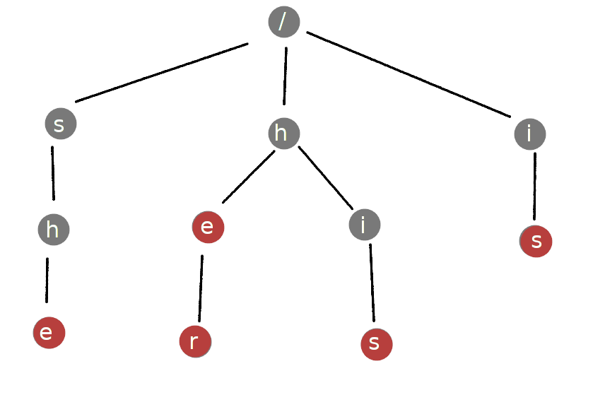
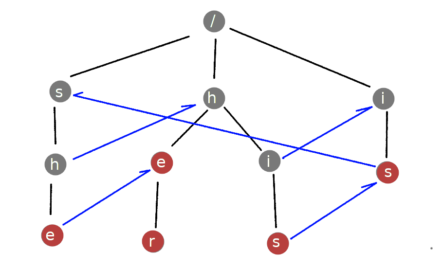

AC自动机是一种综合了Tire树与KMP算法思想的字符串匹配算法，特点是同时进行多个模式串的匹配。

## AC自动机介绍

AC自动机利用KMP([[字符串匹配之KMP]])的最长成功匹配思想对Tire树进行改造，使得搜索效率大副提高，并且可以对多个模式串进行匹配。缺点是效大的空间复杂度，是一种空间换时间的算法。

## Tire树

Tire树也就是字典树，可以提供高效的字符串查找。要构造一个Tire树，需要明确：

1. 一个字母表，包括所有模式串中可能出现的字符。
2. 至少一个模式串。

构造过程为从根节点开始，对每个串的字符逐位判断，若存在字符相同的子节点则转移到子节点。否则创建一个新节点，并令其字符为当前字符。将每个串遍历结束时停留的节点标记为接受节点。下一个串仍从根节点开始构造。

比如字母表限定为“小写英文字母（a-z）”，模式串为{"she","he","her","his","is"}时，可以生成如下所示Tire树：



要判断一个串是否与某一模式串相同只需要从根节点开始，对待匹配串逐位判断，若存在与该位字符相同的子节点则转移，否则匹配失败。如果匹配结束时停留在接受节点则匹配成功。例如：

* 待匹配串为"her"：
  * 初始位置为根节点，匹配字符'h'，存在字符为'h'的子节点，转移到对应节点。
  * 匹配字符'e'，存在，转移到对应节点。
  * 匹配字符'r'，存在，转移到对应节点。
  * 匹配完成，当前节点为接受节点，匹配成功。
* 待匹配串为"sh":
  * 初始位置为根节点，匹配字符's'，存在，转移到对应节点。
  * 匹配字符'h'，存在，转移到对应节点。
  * 匹配完成，当前节点不是接受节点，匹配失败。
* 待匹配串为"rsg":
  * 初始位置为根节点，匹配字符'r'，不存在，匹配失败。

## 多模式匹配

在Tire树中，一个节点表示的是从根节点到该点的路径对应的串。如上图树中最下层的'r'节点表示的是字符串"her"。考虑字符串"sher"，如果要求出各模式串在其中出现的次数，通常做法就是逐位与所有模式进行匹配：

* ”sher"匹配{"she","he","her","his","is"}
* ”her"匹配{"she","he","her","his","is"}
* ”er"匹配{"she","he","her","his","is"}
* ”r"匹配{"she","he","her","his","is"}

这里的匹配规则稍作改动，只要到达接受结点就算一次成功。也就是从匹配整个串变为匹配是否存在一个与模式相同的前缀。

问题是，匹配次数太多，且多数是不必要的。比如对"er"与"r"的10次（每个串分别与5个模式进行匹配）。以及"sher"对除"she"外的模式的4次匹配和"her"对"is"与"she"的2次匹配。在20次匹配中共有16次匹配是没有必要的，大大降低了去处效率。

在KMP思想的启发下，可以引入一个最长后缀的概念。当匹配失败时，转移到已匹配部分的最长后缀对应的节点继续匹配，就减少了不必要的匹配。

如对"sher"而言，匹配到"she"模式的末尾时位于第4层的'e'节点。匹配'r'时，无对应子节点而匹配失败，此时不从头开始，而是转移到第3层的'e'节点，其对应的"he"为"she"在该图中的最长后缀，此时继续匹配'r'，发现对应子节点，并转移到'r'。匹配结束，路径上的共有3个接受节点，分别对应"she"、"he"、"her"，这三个模式的匹配次数分别+1。

如果将每个节点的失败后转移节点标记出来，就形成了下图结构（蓝色箭头表示失败后转移节点，没有标记的则转移到根节点）：



## 失配指针

上一节中的匹配方式就构成了AC自动机。AC自动机算法即是在Tire树的基础上加入了匹配失败的处理，使其达成了很高的多次匹配效率，主要用于匹配子串中各模式串出现的位置与次数。其中匹配失败处理就是通过失配指针实现的，即在每个节点中加入一个指针指向匹配失败后转移的节点。

失配指针可以使用如下方法得到：

``` none
// queue: 一个队列，保存节点指针
// root: 根节点
// 将根节点的fail指针设为null，并将其所有子节点入队
root->fail = null
for p in root.childs:
    queue.push(p)
// 层序遍历tire树
while !queue.empty():
    // 对当前节点，先将其fail值默认为root
    cur = queue.pop();
    cur->fail = root
    
    for p in cur.childs:
        queue.push(p)
    // 寻找其父节点的fail指针指向的节点的子节点
    // 找到的第一个与当前节点值相同的节点就是当前节点的最长后缀节点
    // 若没有相应的子节点，则迭代寻找fail的fail指针指向的节点。
    fail = cur->parent->fail
    while fail != null and cur->fail == root:
        for p in fail.childs:
            if p->value == cur->value:
                cur->fail = p
        fail = fail->fail
```

## 匹配过程

``` none
// str:待匹配串
// root:自动机根节点
// 令cur指向根节点，并对str逐位匹配
cur = root
for i in (0, str.length()):
    // 如果当前节点不存在str[i]对应的子节点，则进入cur->fail
    // 循环直到存在对应节点或到达根节点
	auto index = Node::get_index(str[i])
	while cur->childs[index] == nullptr && cur != root :
		cur = cur->fail
	// 如果仍没有对应节点，则退出此轮循环
	if cur->childs[index] == nullptr :
    	continue
   	// 进入到对应节点中，同时使用temp遍历该节点的所有后缀
   	// 将路径上的所有接受节点对应模式出现次数+1
	cur = cur->childs[index]
	temp = cur
	while temp != nullptr :
		for  p in temp->patterns :
		    ++nums[p]
		temp = temp->fail
```

## C++实现

给出一个字母表为小写字母且不考虑内存泄露的简单实现：

```cpp
class ACAutomaton {
public:
    ACAutomaton(const vector<string> &patterns) 
    : root(new Node(nullptr)), nums(patterns.size(), 0) {
        generate_tire(patterns);
        generate_fails();
    }

    void match(const string& str) {
        auto cur = root;
        int i = 0;
        while (i < str.length()) {
            auto index = Node::get_index(str[i]);
            while (cur->childs[index] == nullptr && cur != root) {
                cur = cur->fail;
            }
            ++i;
            if (cur->childs[index] == nullptr) continue;
            cur = cur->childs[index];
            auto temp = cur;
            while (temp != nullptr) {
                for (auto p : temp->patterns) {
                    ++nums[p];
                }
                temp = temp->fail;
            }
        }
    }

    const vector<int> &get_nums() const {
        return nums;
    }
private:
    struct Node {
        Node (Node *parent_) 
        : value(0), parent(parent_), fail(nullptr) {}

        static int get_index(char c) {
            return c - 'a';
        }

        char value;
        vector<int> patterns;

        Node *parent;
        Node *fail;
        Node *childs[26] = {nullptr};
    };

    Node *root;
    vector<int> nums;
	
    void generate_tire(const vector<string> &patterns) {
        for (int i = 0; i < patterns.size(); ++i) {
            auto cur = root;
            for (auto c : patterns[i]) {
                auto index = Node::get_index(c);
                if (cur->childs[index] == nullptr) {
                    cur->childs[index] = new Node(cur);
                    cur->childs[index]->value = c;
                }
                cur = cur->childs[index];
            }
            cur->patterns.push_back(i);
        }
    }

    void generate_fails() {
        queue<Node*> q;
        root->fail = nullptr;
        for (int i = 0; i < 26; ++i) {
            if (root->childs[i])
                q.push(root->childs[i]);
        }
        while (!q.empty()) {
            auto cur = q.front();
            q.pop();
            cur->fail = root;

            for (int i = 0; i < 26; ++i) {
                if (cur->childs[i]) 
                    q.push(cur->childs[i]);
            }

            auto f = cur->parent->fail;
            while (f != nullptr && cur->fail == root) {
                auto index = Node::get_index(cur->value);
                if (f->childs[index]) {
                    cur->fail = f->childs[index];
                }
                f = f->fail;
            }
        } // while !q.empty
    } // generate_fails
};
```

